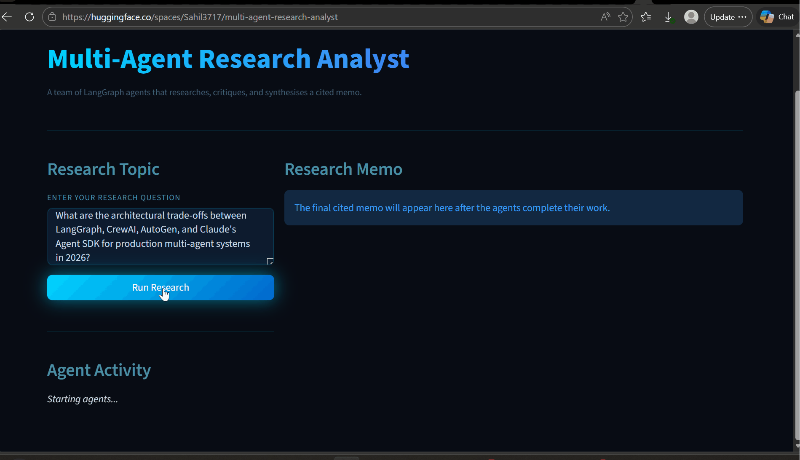

## 1. Project overview

### What we're building
A LangGraph multi-agent system where three specialized agents collaborate to produce a cited memo on any researchable topic. The differentiator is an **explicit critique loop**: a critic agent reviews the researcher's notes and forces revisions until the evidence base is strong enough, only then does the synthesizer write the memo.

### Why this design
Most "agent" demos are a single LLM with a search tool. That's table stakes. Real agentic value comes from multiple agents with distinct responsibilities and a feedback loop — which is exactly what this project demonstrates.

### Success criteria (the bar for "shipped")
- [ ] User enters a topic in Streamlit, clicks run, sees agents work, gets a cited memo.
- [ ] The critique loop runs at least once on most queries (visible in UI).
- [ ] Output memo contains ≥3 distinct source URLs, each cited inline.
- [ ] Live demo deployed on Hugging Face Spaces, public URL.
- [ ] `tests/test_smoke.py` passes — graph compiles, basic flow runs.
- [ ] README has architecture diagram, eval table with real numbers, quickstart.
- [ ] One demo GIF embedded in README.

---

## 2. Architecture

### Agent responsibilities
- **Researcher** — given a research question, plan 2–4 sub-questions, run Tavily searches, take structured notes (claim + source URL + confidence).
- **Critic** — review notes; emit a structured critique (gaps, weak sources, contradictions); decide either `approve` or `request_revision` with specific follow-up questions.
- **Synthesizer** — when critic approves, write the final memo with inline citations like `[1]` and a sources list.

### Graph topology

```
START → researcher → critic → (synthesizer | researcher) → END
                       ↑                            │
                       └─── loop on revision ───────┘
                       (max MAX_CRITIQUE_ROUNDS rounds, default 3)
```

### Shared state (Pydantic)
```python
class AgentState(BaseModel):
    query: str
    sub_questions: list[str] = []
    notes: list[ResearchNote] = []          # accumulated across rounds
    critiques: list[Critique] = []          # history of critic outputs
    revision_round: int = 0
    final_memo: Memo | None = None
```

---

## 3. Tech stack (Groq edition)

| Component | Choice | Rationale |
|---|---|---|
| Orchestration | LangGraph | Industry standard for agent graphs in 2026 |
| LLM | Groq + `llama-3.3-70b-versatile` | Free, very fast, open weights |
| Search | Tavily API | Built for agent workflows, free tier |
| Schemas | Pydantic v2 | Strict typed agent I/O |
| UI | Streamlit | Fastest path to a deployable demo |
| Env mgmt | uv | Fast, modern Python tooling |
| Deploy | Hugging Face Spaces (Streamlit SDK) | Free GPU/CPU, easy secrets |
| Tests | pytest | Standard |
| Tracing | (optional) LangSmith | Add only if there's time on Day 4 |

---

## 4. Day-by-day plan

### Day 1 — Scaffold (DONE if you've already pasted the first prompt)
- [x] Project structure created
- [x] `pyproject.toml` with uv
- [x] Streamlit boots with placeholder UI
- [x] `.env.example` and `.env` set up
- [x] Initial commits pushed

### Day 2 — Researcher agent end-to-end
**Goal:** A working researcher that, given a query, produces a list of `ResearchNote` objects with real sources.

Tasks:
- Implement `tools/search.py` — wrap Tavily as a LangChain tool with retry on rate-limit.
- Define `schemas.py` — `ResearchQuery`, `ResearchNote` (claim, source_url, source_title, confidence), `Critique`, `Memo`, `AgentState`.
- Implement `agents/researcher.py` — system prompt that decomposes the query, runs searches, calls `model.with_structured_output(list[ResearchNote])`.
- Wire researcher node into `graph.py` (single-node graph for now).
- Write `tests/test_researcher.py` — mocked Tavily, verifies structured output shape.
- CLI smoke test: `python -m research_analyst.graph "How does ASML's monopoly affect chip prices?"` should print notes.

End-of-day artifact: real notes from a real query in your terminal.

### Day 3 — Critic + synthesizer + loop + streaming UI
**Goal:** Full graph running end-to-end with streaming UI.

Tasks:
- Implement `agents/critic.py` — structured output with `verdict: Literal["approve", "request_revision"]` and `follow_up_questions: list[str]`.
- Implement `agents/synthesizer.py` — structured output `Memo` with `title`, `summary`, `sections`, `sources`.
- Wire the loop in `graph.py` — conditional edge from critic: if `request_revision`, route back to researcher with new sub-questions; if `approve`, route to synthesizer.
- Cap loop at `MAX_CRITIQUE_ROUNDS` (default 3) — after that, force synthesizer to run regardless.
- Streamlit UI:
  - Topic input + Run button.
  - Side panel: live stream of "Researcher is searching…", "Critic finds 2 gaps…", etc. — use LangGraph's `astream_events` to emit per-node updates.
  - Main panel: final memo rendered as markdown with citations.
- Tests: `test_graph_smoke.py` — full graph runs on a canned query with mocked LLM.

End-of-day artifact: local Streamlit demo feels like a product.

### Day 4 — Evals + deploy + polish
**Goal:** Real eval numbers in the README, live demo on HF Spaces, GIF, pinned on profile.

Tasks:
- Eval harness: `eval/run_eval.py` — runs 10 canned queries through (a) a single-agent baseline and (b) this multi-agent system. Captures: source count, unique domains, latency, manual hallucination flag (you'll tag these by hand — be honest).
- Eval results table — drop real numbers into README's "Results" section.
- Architecture diagram — Excalidraw or Mermaid → save as `docs/architecture.png`.
- Demo GIF — ScreenToGif → 10–15 sec loop → `docs/demo.gif`.
- Replace placeholder README with the full template (see §6 below) — fill in the real eval numbers.
- Deploy to HF Spaces:
  - Create Space (`huggingface.co/new-space`), Streamlit SDK, public.
  - Push code to the Space repo as a second remote.
  - Add `GROQ_API_KEY` and `TAVILY_API_KEY` as Space Secrets.
  - Verify live URL works.
- Pin repo on `github.com/sahilmdeshmukh` profile.
- Update `CLAUDE.md` status section.
- (Optional but high-leverage) Write a 400-word "How I built it" blog post on Hashnode or dev.to.

End-of-day artifact: live URL + clean README + pinned repo. Portfolio piece #1 shipped.

---

## 5. Per-session handoff prompts (paste into Claude Code in order)

### Session 1 — Day 2 (researcher agent)

```
Read PLAN.md and CLAUDE.md, then read the current src/ to understand
where the scaffold left off.

Today's goal: Day 2 from PLAN.md — implement the researcher agent end-to-end.

Plan before code. Propose a checklist of changes covering:
1. tools/search.py — Tavily wrapper with rate-limit retry
2. schemas.py — Pydantic models per PLAN.md §2
3. agents/researcher.py — system prompt + structured output
4. graph.py — single-node graph wiring just the researcher
5. tests/test_researcher.py — mocked Tavily test
6. A CLI smoke test command I can run

Confirm with me before writing code. Then implement in atomic commits
with conventional commit messages. After implementation, run the
smoke test and the unit tests; fix any failures before declaring done.

End of session: update CLAUDE.md status section, commit, push.
```

### Session 2 — Day 3 (critic + synthesizer + loop + UI)

```
Read PLAN.md and CLAUDE.md and the current state of src/.

Today's goal: Day 3 from PLAN.md — implement critic, synthesizer, the
critique loop in graph.py, and the streaming Streamlit UI.

Plan before code. Propose the checklist of changes, with special
attention to:
- The conditional edge from critic (approve → synthesizer, request_revision → researcher)
- The MAX_CRITIQUE_ROUNDS guard
- Using astream_events for live UI updates
- Handling Groq's occasional structured-output retries

Confirm with me before writing. Atomic commits. Run tests after each
agent is implemented; fix failures inline.

End of session: full demo runnable locally with `uv run streamlit run app.py`.
Update CLAUDE.md status. Commit, push.
```

### Session 3 — Day 4 part 1 (eval harness)

```
Read PLAN.md and CLAUDE.md.

Today's first goal: build the eval harness from Day 4 of PLAN.md.

Create eval/run_eval.py:
- 10 canned research queries in eval/queries.yaml — diverse topics
- For each query, run both:
  (a) a single-agent baseline (one LLM call + tavily, no loop)
  (b) this multi-agent system
- Capture per run: source_count, unique_domains, latency_seconds, memo_length_words
- Print a comparison table at the end + save as eval/results.json

Important: the eval should be reproducible. Set seed where possible,
log model versions.

After it runs, I'll manually score hallucinated_citations by reviewing
each memo. Add a CLI flag for "I've reviewed the results, here are my
hallucination scores" that updates results.json.

Commit and push.
```

### Session 4 — Day 4 part 2 (README + deploy)

```
Read PLAN.md, CLAUDE.md, eval/results.json (with my manual scores filled in).

Today's final goal: ship the project publicly.

Tasks:
1. Replace README.md with the polished template from PLAN.md §6.
   Fill the Results table with REAL numbers from eval/results.json —
   don't invent any. If a metric didn't pan out (e.g., baseline tied
   on source count), say so honestly.
2. Generate a Mermaid architecture diagram in docs/architecture.md
   and a rendered PNG in docs/architecture.png.
3. Tell me exactly what to do to deploy to Hugging Face Spaces —
   step by step, since I haven't done this before. I'll run the
   commands; you watch the output.
4. After deploy, update README with the live demo URL.
5. Update CLAUDE.md status: all boxes checked.
6. Suggest a single commit message summarizing the v1 release.

Don't touch the LinkedIn post. I'll handle that separately based on
real numbers.
```

---

## 6. Final README template (use on Day 4)

Replace `README.md` with this. **Fill the bracketed parts with real values.**

```markdown
# Multi-Agent Research Analyst

> A team of LangGraph agents that researches a topic, critiques its own findings, and produces a cited memo. Demonstrates agentic orchestration with an explicit critique loop.



[**Live demo →**](https://huggingface.co/spaces/sahilmdeshmukh/multi-agent-research-analyst)

## Why this exists

Most agent demos are a single LLM with a search tool. Real agentic systems need
specialized agents and a self-correction loop. This project compares a
multi-agent system with explicit critique against a single-agent baseline on
the same queries.

## What it does

- **Researcher agent** decomposes the query into sub-questions, searches Tavily,
  produces structured notes (claim + source).
- **Critic agent** reviews notes for gaps, weak sources, contradictions; emits
  follow-up questions or approves.
- **Synthesizer agent** writes the final cited memo only after critic approves.
- Loop is capped at `MAX_CRITIQUE_ROUNDS` revisions.

## Architecture


## Results (n=10 queries)

| Metric | Single-agent baseline | Multi-agent (this) | Delta |
|---|---|---|---|
| Avg unique source domains | [X.X] | [X.X] | [+N%] |
| Avg memo length (words) | [N] | [N] | [+N%] |
| Hallucinated citations (manual count) | [N] | [N] | [-N] |
| Avg latency (s) | [N.N] | [N.N] | [+Nx] |

Tradeoff: more latency for materially better source quality and fewer
hallucinations. See `eval/results.json` for raw data.

## Tech choices

- **Groq + Llama 3.3 70b** for inference — chosen for sub-second per-call
  latency and zero-cost development. Provider-agnostic LangGraph wiring means
  swapping to Anthropic, OpenAI, or Gemini is a config change.
- **LangGraph** for the orchestration — explicit state, conditional edges,
  easy to reason about.
- **Tavily** for web search — built for agent workflows.

## Quickstart

\`\`\`bash
git clone git@github.com:sahilmdeshmukh/multi-agent-research-analyst.git
cd multi-agent-research-analyst

uv sync
cp .env.example .env   # add GROQ_API_KEY and TAVILY_API_KEY

uv run streamlit run app.py
# open http://localhost:8501
\`\`\`

## Configuration (`.env`)

| Variable | Required | Default |
|---|---|---|
| `GROQ_API_KEY` | yes | — |
| `TAVILY_API_KEY` | yes | — |
| `RESEARCHER_MODEL` | no | `llama-3.3-70b-versatile` |
| `CRITIC_MODEL` | no | `llama-3.3-70b-versatile` |
| `SYNTHESIZER_MODEL` | no | `llama-3.3-70b-versatile` |
| `MAX_CRITIQUE_ROUNDS` | no | `3` |

## Tech stack

LangGraph · langchain-groq · Tavily · Streamlit · Pydantic · uv · pytest

## Roadmap

- [x] Three-agent loop with critique
- [x] Streaming UI
- [x] Eval harness
- [x] Deployed on HF Spaces
- [ ] LangSmith trace export
- [ ] Citation verification agent (cross-checks claims against source text)
- [ ] Long-term memory via Qdrant

## License

MIT
```

---

## 7. Anti-patterns to watch for

When Claude Code does any of these, push back:

- **Writing all four days in one session.** Force session boundaries — quality drops past 90 minutes of generated code without you reviewing.
- **Generating fake eval numbers.** Numbers go in the README only after `eval/run_eval.py` produces them. No placeholder magic numbers.
- **Skipping tests.** Every agent gets at least one test before being declared done.
- **Bundling 10 changes into one commit.** Atomic commits, conventional commit messages.
- **Adding dependencies you didn't ask for.** If it suggests LlamaIndex, LangSmith, Qdrant, etc., ask why. Lean stack.
- **Trying to make the baseline look bad.** The single-agent baseline in the eval must be a fair, sincere implementation. If your multi-agent system doesn't win on real fair eval, the project is more honest — and recruiters can tell.

---

## 8. When you finish

After Day 4 ships:
1. Move on to Project 2 (Agentic RAG). Repeat this exact playbook with that repo.
2. Write a 400–600 word blog post (Hashnode / Medium / dev.to). Link it from the README.
3. Post the LinkedIn announcement using **real numbers** from `eval/results.json`. Tag @LangChainAI, @GroqInc, @huggingface.
4. Update your profile README to feature this project under "Featured projects".

— That's the plan. Ship it.
