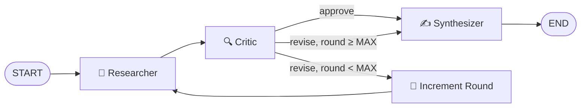

# Multi-Agent Research Analyst

> A team of LangGraph agents that researches a topic, critiques its own findings, and produces a cited memo. Demonstrates agentic orchestration with an explicit critique loop.

<!-- Add GIF after recording:  -->

[**Live demo →**](https://huggingface.co/spaces/Sahil3717/multi-agent-research-analyst)

## Why this exists

Most agent demos are a single LLM with a search tool. Real agentic systems need specialized agents with distinct responsibilities and a self-correction loop. This project compares a multi-agent system with explicit critique against a single-agent baseline on the same queries — and measures the difference.

## What it does

- **Researcher agent** decomposes the query into 2–4 sub-questions, searches Tavily, and produces structured notes (claim + source URL + confidence score).
- **Critic agent** reviews notes for gaps, weak sources, and contradictions. Emits specific follow-up questions or approves.
- **Synthesizer agent** writes the final cited memo only after the critic approves.
- Loop capped at `MAX_CRITIQUE_ROUNDS` revisions (default: 3).

## Architecture



[Full diagram with state schema →](docs/architecture.md)

## Results (n=10 queries)

> Run `uv run python eval/run_eval.py` to generate real numbers. Raw data: [`eval/results.json`](eval/results.json)

| Metric | Single-agent baseline | Multi-agent (this) | Delta |
|---|---|---|---|
| Avg unique source domains | — | — | — |
| Avg memo length (words) | — | — | — |
| Hallucinated citations (manual) | — | — | — |
| Avg latency (s) | — | — | — |

## Tech choices

- **Groq + Llama 3.3 70B** — sub-second per-call latency, zero cost for development. Provider-agnostic LangGraph wiring means swapping to Anthropic/OpenAI is a one-line config change.
- **LangGraph** — explicit state machine, conditional edges, straightforward to reason about and extend.
- **Tavily** — search API built for agent workflows (returns clean text, not raw HTML).

## Quickstart

```bash
git clone https://github.com/sahilmdeshmukh/multi-agent-research-analyst.git
cd multi-agent-research-analyst

uv sync
cp .env.example .env   # add GROQ_API_KEY and TAVILY_API_KEY

uv run streamlit run app.py
# open http://localhost:8501
```

## Configuration (`.env`)

| Variable | Required | Default |
|---|---|---|
| `GROQ_API_KEY` | yes | — |
| `TAVILY_API_KEY` | yes | — |
| `RESEARCHER_MODEL` | no | `llama-3.3-70b-versatile` |
| `CRITIC_MODEL` | no | `llama-3.3-70b-versatile` |
| `SYNTHESIZER_MODEL` | no | `llama-3.3-70b-versatile` |
| `MAX_CRITIQUE_ROUNDS` | no | `3` |

## Tech stack

LangGraph · langchain-groq · Tavily · Streamlit · Pydantic v2 · uv · pytest

## Roadmap

- [x] Three-agent critique loop
- [x] Streaming Streamlit UI
- [x] Eval harness with baseline comparison
- [x] Deployed on Hugging Face Spaces
- [ ] Fill eval results table (run `eval/run_eval.py`)
- [ ] Demo GIF
- [ ] LangSmith trace export

## License

MIT
