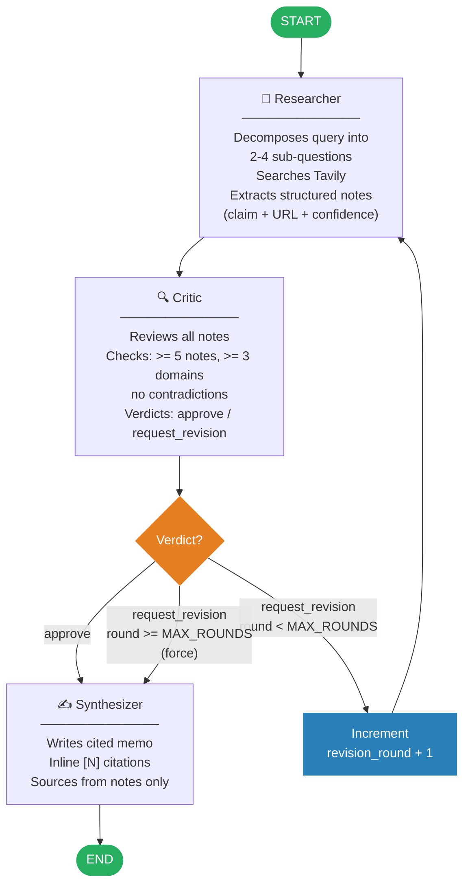

# Architecture

The system is a three-agent LangGraph pipeline with an explicit critique loop.

## Agent State

Shared `AgentState` (Pydantic) flows through all nodes:

| Field | Type | Description |
|---|---|---|
| `query` | `str` | Original research question |
| `sub_questions` | `list[str]` | Decomposed search queries |
| `notes` | `list[ResearchNote]` | Accumulated across all rounds |
| `critiques` | `list[Critique]` | History of critic verdicts |
| `revision_round` | `int` | Current loop iteration (0-indexed) |
| `final_memo` | `Memo \| None` | Output — set by synthesizer |

## Key Design Decisions

- **Critique loop capped at `MAX_CRITIQUE_ROUNDS` (default 3)** — prevents infinite loops on hard queries
- **Notes accumulate across rounds** — each revision adds to the evidence base, not replaces it
- **Groq `with_structured_output(Model)`** — all agent I/O is typed Pydantic; bare `list[T]` is wrapped in `ResearchNoteList` to work around Groq structured output limitations
- **Shared `get_groq_llm()` factory** — all three agents use the same factory from `llm.py`
