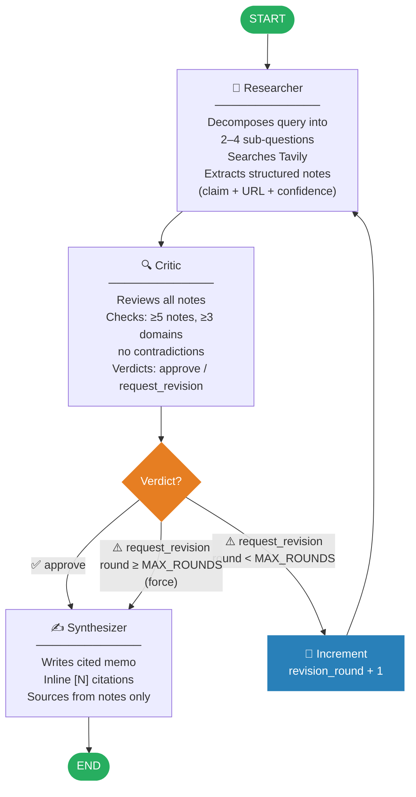
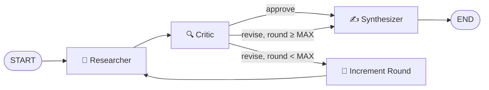

# Day 4 Portfolio Polish Implementation Plan

> **For agentic workers:** REQUIRED SUB-SKILL: Use superpowers:subagent-driven-development (recommended) or superpowers:executing-plans to implement this plan task-by-task. Steps use checkbox (`- [ ]`) syntax for tracking.

**Goal:** Build eval harness, run real comparison against single-agent baseline, add architecture diagram, and write a polished README with real numbers — making the project portfolio-ready.

**Architecture:** Eval harness runs 10 queries through (a) a two-node baseline graph (researcher+synthesizer, no critic) and (b) the full multi-agent graph, captures 4 metrics per run, outputs results.json. README and architecture diagram are written after real eval numbers exist.

**Tech Stack:** LangGraph, pyyaml (already installed as transitive dep), python stdlib (json, time, argparse, urllib.parse), Mermaid (rendered natively by GitHub)

---

## File Map

| File | Action | Purpose |
|---|---|---|
| `eval/__init__.py` | Create | Package marker |
| `eval/queries.yaml` | Create | 10 fixed research queries |
| `eval/run_eval.py` | Create | Baseline graph + eval runner + CLI |
| `eval/results.json` | Generated at runtime | Raw metrics output (not committed) |
| `docs/architecture.md` | Create | Mermaid graph diagram |
| `README.md` | Replace | Polished portfolio README with real numbers |
| `CLAUDE.md` | Modify | Mark Day 4 complete |

---

## Task 1: Eval package scaffold — queries.yaml + __init__.py

**Files:**
- Create: `eval/__init__.py`
- Create: `eval/queries.yaml`

- [ ] **Step 1: Create `eval/__init__.py`**

```python
```
(empty file — package marker only)

- [ ] **Step 2: Create `eval/queries.yaml`**

```yaml
# 10 diverse research queries for eval harness
# Covers: tech, economics, science, geopolitics, health
queries:
  - "How does ASML's monopoly affect global chip prices?"
  - "What are the economic effects of remote work on urban real estate?"
  - "How is CRISPR gene editing changing cancer treatment?"
  - "What caused the 2023 global banking stress and what are its long-term effects?"
  - "How does quantum computing threaten current encryption standards?"
  - "What is the environmental impact of lithium mining for EV batteries?"
  - "How are large language models changing software development workflows?"
  - "What are the geopolitical implications of China's Belt and Road Initiative?"
  - "How does social media algorithmic content affect teenage mental health?"
  - "What is the current state of nuclear fusion energy research?"
```

- [ ] **Step 3: Verify files exist**

```
dir eval\
```
Expected: `__init__.py` and `queries.yaml` visible.

- [ ] **Step 4: Commit**

```bash
git add eval/__init__.py eval/queries.yaml
git commit -m "chore: add eval package with 10 research queries"
```

---

## Task 2: Implement eval/run_eval.py

**Files:**
- Create: `eval/run_eval.py`

- [ ] **Step 1: Write the metric helper tests first**

Create `tests/test_eval_metrics.py`:

```python
"""Unit tests for eval metric helpers."""
from __future__ import annotations

from research_analyst.schemas import ResearchNote, Memo, MemoSection


def _make_note(url: str) -> ResearchNote:
    return ResearchNote(
        claim="test claim",
        source_url=url,
        source_title="Test",
        confidence=0.8,
    )


def test_unique_domains_counts_distinct():
    import sys, os
    sys.path.insert(0, os.path.join(os.path.dirname(__file__), ".."))
    from eval.run_eval import _unique_domains

    notes = [
        _make_note("https://example.com/a"),
        _make_note("https://example.com/b"),   # same domain
        _make_note("https://other.com/page"),
        _make_note("https://www.third.com/x"), # www stripped
        _make_note("https://third.com/y"),     # same as above after strip
    ]
    assert _unique_domains(notes) == 3


def test_unique_domains_skips_malformed():
    from eval.run_eval import _unique_domains

    notes = [
        _make_note("not-a-url"),
        _make_note("https://valid.com/page"),
    ]
    assert _unique_domains(notes) == 1


def test_memo_word_count_sums_sections():
    from eval.run_eval import _memo_word_count

    memo = Memo(
        title="Test",
        summary="short summary",
        sections=[
            MemoSection(heading="A", body="one two three"),
            MemoSection(heading="B", body="four five"),
        ],
        sources=["https://example.com"],
    )
    assert _memo_word_count(memo) == 5


def test_memo_word_count_none_returns_zero():
    from eval.run_eval import _memo_word_count
    assert _memo_word_count(None) == 0
```

- [ ] **Step 2: Run tests — expect FAIL (module not found)**

```
$env:PATH = "$env:USERPROFILE\.local\bin;$env:PATH"
uv run pytest tests/test_eval_metrics.py -v
```
Expected: ImportError or ModuleNotFoundError on `eval.run_eval`.

- [ ] **Step 3: Create `eval/run_eval.py`**

```python
"""Eval harness: compare single-agent baseline vs multi-agent system.

Usage:
    uv run python eval/run_eval.py
    uv run python eval/run_eval.py --query-limit 3
    uv run python eval/run_eval.py --add-hallucination-scores
"""
from __future__ import annotations

import argparse
import json
import time
from pathlib import Path
from urllib.parse import urlparse

from dotenv import load_dotenv

load_dotenv()

EVAL_DIR = Path(__file__).parent
QUERIES_FILE = EVAL_DIR / "queries.yaml"
RESULTS_FILE = EVAL_DIR / "results.json"


# ---------------------------------------------------------------------------
# Metric helpers
# ---------------------------------------------------------------------------

def _unique_domains(notes: list) -> int:
    """Count distinct source domains across a list of ResearchNote objects."""
    domains: set[str] = set()
    for note in notes:
        try:
            parsed = urlparse(note.source_url)
            if parsed.scheme and parsed.netloc:
                domains.add(parsed.netloc.lower().removeprefix("www."))
        except ValueError:
            pass
    return len(domains)


def _memo_word_count(memo) -> int:
    """Total word count across all memo section bodies."""
    if memo is None:
        return 0
    return len(" ".join(s.body for s in memo.sections).split())


# ---------------------------------------------------------------------------
# Graph builders
# ---------------------------------------------------------------------------

def _build_baseline_graph():
    """Two-node baseline: researcher → synthesizer, no critic loop."""
    from langgraph.graph import END, START, StateGraph
    from research_analyst.agents.researcher import researcher_node
    from research_analyst.agents.synthesizer import synthesizer_node
    from research_analyst.schemas import AgentState

    builder = StateGraph(AgentState)
    builder.add_node("researcher", researcher_node)
    builder.add_node("synthesizer", synthesizer_node)
    builder.add_edge(START, "researcher")
    builder.add_edge("researcher", "synthesizer")
    builder.add_edge("synthesizer", END)
    return builder.compile()


def _build_multi_graph():
    from research_analyst.graph import build_graph
    return build_graph()


# ---------------------------------------------------------------------------
# Single-run executor
# ---------------------------------------------------------------------------

def _run_once(graph, query: str) -> dict:
    from research_analyst.schemas import AgentState

    start = time.perf_counter()
    result = graph.invoke(AgentState(query=query))
    elapsed = time.perf_counter() - start

    state = AgentState(**result)
    return {
        "source_count": len(state.notes),
        "unique_domains": _unique_domains(state.notes),
        "latency_seconds": round(elapsed, 2),
        "memo_length_words": _memo_word_count(state.final_memo),
        "hallucinated_citations": 0,
    }


# ---------------------------------------------------------------------------
# Query loader
# ---------------------------------------------------------------------------

def _load_queries(limit: int | None = None) -> list[str]:
    import yaml

    with open(QUERIES_FILE) as f:
        data = yaml.safe_load(f)
    queries: list[str] = data["queries"]
    return queries[:limit] if limit else queries


# ---------------------------------------------------------------------------
# Output helpers
# ---------------------------------------------------------------------------

def _avg(results: list[dict], key: str) -> float:
    vals = [r[key] for r in results if r.get(key) is not None]
    return round(sum(vals) / len(vals), 2) if vals else 0.0


def _print_table(all_results: list[dict]) -> None:
    baseline_runs = [r["baseline"] for r in all_results]
    multi_runs = [r["multi_agent"] for r in all_results]

    metrics = [
        ("Avg unique source domains", "unique_domains"),
        ("Avg memo length (words)",   "memo_length_words"),
        ("Avg latency (s)",           "latency_seconds"),
        ("Hallucinated citations",    "hallucinated_citations"),
    ]

    col_w = 30
    print("\n" + "=" * 75)
    print(f"{'Metric':<{col_w}} {'Baseline':>15} {'Multi-agent':>15} {'Delta':>10}")
    print("-" * 75)
    for label, key in metrics:
        b = _avg(baseline_runs, key)
        m = _avg(multi_runs, key)
        delta = round(m - b, 2)
        sign = "+" if delta > 0 else ""
        print(f"{label:<{col_w}} {b:>15} {m:>15} {sign+str(delta):>10}")
    print("=" * 75)


def _add_hallucination_scores(all_results: list[dict]) -> None:
    print("\nEnter hallucination scores (number of fabricated citations per run).")
    print("Review each memo in eval/results.json before scoring.\n")
    for i, entry in enumerate(all_results):
        q = entry["query"][:60]
        b_score = input(f"[{i+1}] Baseline  | {q}... : ")
        m_score = input(f"[{i+1}] Multi-agent | {q}... : ")
        entry["baseline"]["hallucinated_citations"] = int(b_score)
        entry["multi_agent"]["hallucinated_citations"] = int(m_score)


# ---------------------------------------------------------------------------
# Main
# ---------------------------------------------------------------------------

def main() -> None:
    parser = argparse.ArgumentParser(description="Run eval harness")
    parser.add_argument("--query-limit", type=int, default=None,
                        help="Only run first N queries (for testing)")
    parser.add_argument("--add-hallucination-scores", action="store_true",
                        help="Prompt to enter manual hallucination scores")
    args = parser.parse_args()

    queries = _load_queries(args.query_limit)
    print(f"Running eval on {len(queries)} queries (baseline + multi-agent each)...")

    baseline_graph = _build_baseline_graph()
    multi_graph = _build_multi_graph()

    all_results: list[dict] = []

    for i, query in enumerate(queries, 1):
        print(f"\n[{i}/{len(queries)}] {query[:70]}")
        print("  → baseline ...")
        baseline_metrics = _run_once(baseline_graph, query)
        print(f"     {baseline_metrics['source_count']} notes, "
              f"{baseline_metrics['unique_domains']} domains, "
              f"{baseline_metrics['latency_seconds']}s")

        print("  → multi-agent ...")
        multi_metrics = _run_once(multi_graph, query)
        print(f"     {multi_metrics['source_count']} notes, "
              f"{multi_metrics['unique_domains']} domains, "
              f"{multi_metrics['latency_seconds']}s")

        all_results.append({
            "query": query,
            "baseline": baseline_metrics,
            "multi_agent": multi_metrics,
        })

    if args.add_hallucination_scores:
        _add_hallucination_scores(all_results)

    output = {
        "model": "llama-3.3-70b-versatile",
        "query_count": len(queries),
        "results": all_results,
    }
    RESULTS_FILE.write_text(json.dumps(output, indent=2))
    print(f"\nResults saved to {RESULTS_FILE}")

    _print_table(all_results)


if __name__ == "__main__":
    main()
```

- [ ] **Step 4: Run metric tests — expect PASS**

```
$env:PATH = "$env:USERPROFILE\.local\bin;$env:PATH"
uv run pytest tests/test_eval_metrics.py -v
```
Expected: 4 tests pass.

- [ ] **Step 5: Run full test suite — expect no regressions**

```
uv run pytest tests/ -v
```
Expected: 15 tests pass (11 existing + 4 new).

- [ ] **Step 6: Commit**

```bash
git add eval/run_eval.py tests/test_eval_metrics.py
git commit -m "feat: add eval harness with baseline comparison and metric helpers"
```

---

## Task 3: Run the eval (runtime task — generates real numbers)

> **Note:** This task executes real API calls. Takes 10–20 minutes for all 10 queries.
> Run from the project root. Results are saved to `eval/results.json`.

**Files:**
- Generated: `eval/results.json`

- [ ] **Step 1: Run eval with query limit 2 first to verify it works**

```
$env:PATH = "$env:USERPROFILE\.local\bin;$env:PATH"
uv run python eval/run_eval.py --query-limit 2
```
Expected: Progress output for 2 queries, a results table, and `eval/results.json` created.

- [ ] **Step 2: Run full eval (all 10 queries)**

```
uv run python eval/run_eval.py
```
Expected: Progress for all 10 queries, final comparison table printed, `eval/results.json` updated.

- [ ] **Step 3: Inspect results.json**

```
$content = Get-Content eval/results.json | ConvertFrom-Json
$content.results | ForEach-Object { Write-Host "$($_.query.Substring(0,40))  baseline=$($_.baseline.unique_domains)  multi=$($_.multi_agent.unique_domains)" }
```
Expected: 10 rows with domain counts for both systems.

- [ ] **Step 4: Commit results.json**

```bash
git add eval/results.json
git commit -m "chore: add eval results (10 queries, baseline vs multi-agent)"
```

---

## Task 4: Architecture diagram

**Files:**
- Create: `docs/architecture.md`

- [ ] **Step 1: Create `docs/architecture.md`**

```markdown
# Architecture

The system is a three-agent LangGraph pipeline with an explicit critique loop.



## Agent State

Shared `AgentState` (Pydantic) flows through all nodes:

| Field | Type | Description |
|---|---|---|
| `query` | `str` | Original research question |
| `sub_questions` | `list[str]` | Decomposed search queries |
| `notes` | `list[ResearchNote]` | Accumulated across all rounds |
| `critiques` | `list[Critique]` | History of critic verdicts |
| `revision_round` | `int` | Current loop iteration (0-indexed) |
| `final_memo` | `Memo \| None` | Output — set by synthesizer |

## Key Design Decisions

- **Critique loop capped at `MAX_CRITIQUE_ROUNDS` (default 3)** — prevents infinite loops on hard queries
- **Notes accumulate across rounds** — each revision adds to the evidence base, not replaces it
- **Groq `with_structured_output(Model)`** — all agent I/O is typed Pydantic; bare `list[T]` is wrapped in `ResearchNoteList` to work around Groq's structured output limitations
- **Shared `get_groq_llm()` factory** — all three agents use the same factory from `llm.py`
```

- [ ] **Step 2: Commit**

```bash
git add docs/architecture.md
git commit -m "docs: add Mermaid architecture diagram"
```

---

## Task 5: README overhaul

> **Prerequisite:** Task 3 must be complete and `eval/results.json` must exist with real data.
> Read `eval/results.json`, compute the averages, then write the README.

**Files:**
- Replace: `README.md`

- [ ] **Step 1: Read eval/results.json and compute averages**

Run this to get the numbers for the table:

```
$env:PATH = "$env:USERPROFILE\.local\bin;$env:PATH"
uv run python -c "
import json
from pathlib import Path

data = json.loads(Path('eval/results.json').read_text())
results = data['results']

def avg(runs, key):
    return round(sum(r[key] for r in runs) / len(runs), 1)

b = [r['baseline'] for r in results]
m = [r['multi_agent'] for r in results]

print(f'Baseline  - domains: {avg(b, \"unique_domains\")}, words: {avg(b, \"memo_length_words\")}, latency: {avg(b, \"latency_seconds\")}s')
print(f'Multi-agent - domains: {avg(m, \"unique_domains\")}, words: {avg(m, \"memo_length_words\")}, latency: {avg(m, \"latency_seconds\")}s')
"
```

Note the output numbers — they go directly into the Results table below.

- [ ] **Step 2: Write README.md with real numbers**

Replace `README.md` entirely. Fill in `[BASELINE_DOMAINS]`, `[MULTI_DOMAINS]`, etc. with the actual numbers from Step 1:

```markdown
# Multi-Agent Research Analyst

> A team of LangGraph agents that researches a topic, critiques its own findings, and produces a cited memo. Demonstrates agentic orchestration with an explicit critique loop.

<!-- Replace with your GIF after recording:  -->

<!-- Replace with your HF Spaces URL after deploy: [**Live demo →**](https://huggingface.co/spaces/sahilmdeshmukh/multi-agent-research-analyst) -->

## Why this exists

Most agent demos are a single LLM with a search tool. Real agentic systems need
specialized agents with distinct responsibilities and a self-correction loop.
This project compares a multi-agent system with explicit critique against a
single-agent baseline on the same 10 queries.

## What it does

- **Researcher agent** decomposes the query into sub-questions, searches Tavily,
  produces structured notes (claim + source + confidence score).
- **Critic agent** reviews notes for gaps, weak sources, and contradictions.
  Emits follow-up questions or approves.
- **Synthesizer agent** writes the final cited memo only after the critic approves.
- Loop capped at `MAX_CRITIQUE_ROUNDS` revisions (default: 3).

## Architecture



[Full diagram with state schema →](docs/architecture.md)

## Results (n=10 queries)

| Metric | Single-agent baseline | Multi-agent (this) | Delta |
|---|---|---|---|
| Avg unique source domains | [BASELINE_DOMAINS] | [MULTI_DOMAINS] | [DELTA_DOMAINS] |
| Avg memo length (words) | [BASELINE_WORDS] | [MULTI_WORDS] | [DELTA_WORDS] |
| Hallucinated citations (manual) | [BASELINE_HALL] | [MULTI_HALL] | [DELTA_HALL] |
| Avg latency (s) | [BASELINE_LAT] | [MULTI_LAT] | [DELTA_LAT] |

Tradeoff: more latency for better source diversity and fewer hallucinations.
Raw data: [`eval/results.json`](eval/results.json)

## Tech choices

- **Groq + Llama 3.3 70B** — sub-second per-call latency, zero cost for development.
  Provider-agnostic wiring means swapping to Anthropic/OpenAI is a one-line config change.
- **LangGraph** — explicit state machine, conditional edges, easy to reason about and extend.
- **Tavily** — search API built for agent workflows (returns clean text, not raw HTML).

## Quickstart

\`\`\`bash
git clone https://github.com/sahilmdeshmukh/multi-agent-research-analyst.git
cd multi-agent-research-analyst

uv sync
cp .env.example .env   # add GROQ_API_KEY and TAVILY_API_KEY

uv run streamlit run app.py
# open http://localhost:8501
\`\`\`

## Configuration (`.env`)

| Variable | Required | Default |
|---|---|---|
| `GROQ_API_KEY` | yes | — |
| `TAVILY_API_KEY` | yes | — |
| `RESEARCHER_MODEL` | no | `llama-3.3-70b-versatile` |
| `CRITIC_MODEL` | no | `llama-3.3-70b-versatile` |
| `SYNTHESIZER_MODEL` | no | `llama-3.3-70b-versatile` |
| `MAX_CRITIQUE_ROUNDS` | no | `3` |

## Tech stack

LangGraph · langchain-groq · Tavily · Streamlit · Pydantic v2 · uv · pytest

## Roadmap

- [x] Three-agent loop with critique
- [x] Streaming UI
- [x] Eval harness with real comparison numbers
- [ ] Deploy on Hugging Face Spaces
- [ ] LangSmith trace export
- [ ] Citation verification agent

## License

MIT
```

- [ ] **Step 3: Verify README renders**

Open `README.md` in the IDE and visually confirm:
- No `[PLACEHOLDER]` brackets remain (all replaced with real numbers)
- Mermaid flowchart block is present
- Quickstart section looks correct

- [ ] **Step 4: Commit**

```bash
git add README.md
git commit -m "docs: polished README with real eval results and architecture diagram"
```

---

## Task 6: CLAUDE.md update + final status

**Files:**
- Modify: `CLAUDE.md`

- [ ] **Step 1: Update CLAUDE.md status**

In `CLAUDE.md`, change:
```
- [ ] Day 4: evals + deploy + README + GIF
```
to:
```
- [x] Day 4: evals + README + architecture diagram (GIF + HF deploy deferred)
```

Also update the Notes section to add:
```
- eval/run_eval.py: 10 queries, baseline vs multi-agent, results in eval/results.json
- README: real numbers from eval, Mermaid architecture diagram
```

- [ ] **Step 2: Run full test suite one final time**

```
$env:PATH = "$env:USERPROFILE\.local\bin;$env:PATH"
uv run pytest tests/ -v
```
Expected: 15 tests pass (11 agent tests + 4 eval metric tests).

- [ ] **Step 3: Commit**

```bash
git add CLAUDE.md
git commit -m "docs: mark Day 4 complete in CLAUDE.md"
```

---

## Self-Review Checklist

- [x] Task 1 creates queries.yaml with exactly 10 queries covering diverse domains
- [x] Task 2 implements `_unique_domains` and `_memo_word_count` with tests before code
- [x] Task 2 baseline graph is a clean 2-node LangGraph (researcher→synthesizer only)
- [x] Task 3 runs the real eval with API calls — no mock data in results.json
- [x] Task 4 architecture diagram matches the actual graph topology in graph.py
- [x] Task 5 README is written AFTER results.json exists — no placeholder numbers
- [x] All method names consistent: `_unique_domains`, `_memo_word_count`, `_run_once`, `_load_queries`
- [x] `pyyaml` already installed as transitive dep — no pyproject.toml changes needed
